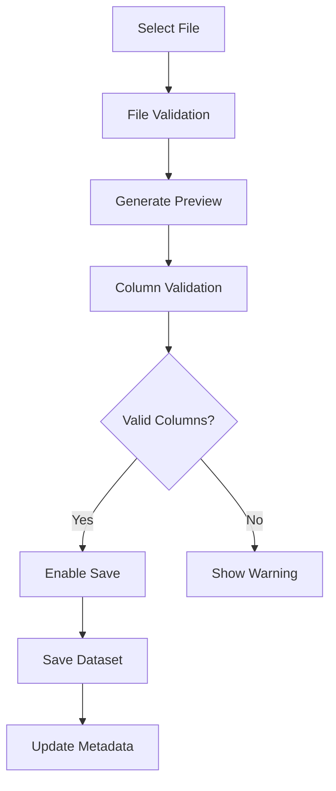
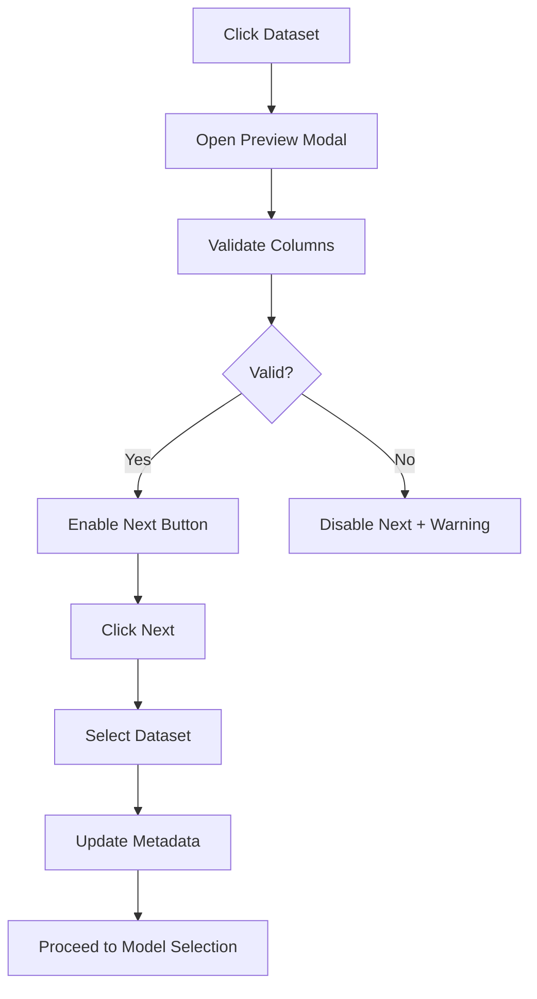

# AI Fine-tuning Dashboard

A modern, React-based dashboard for managing AI model fine-tuning workflows. Built with Next.js, TypeScript, and Tailwind CSS.

## 🚀 Features

### ✅ Dataset Management
- **Upload & Validation**: Upload CSV datasets with automatic validation
- **Column Requirements**: Enforces "input" and "output" column naming
- **Preview & Edit**: Preview datasets before selection with inline editing
- **Metadata Tracking**: Complete dataset lifecycle tracking with UIDs
- **File Storage**: Path tracking for uploaded datasets

### ✅ Workflow Management
- **Multi-step Process**: Guided workflow from dataset to deployment
- **Progress Tracking**: Visual progress stepper across all screens
- **State Persistence**: Metadata system preserves state across sessions
- **Validation Gates**: Prevents progression without required data
- **Session Management**: Unique session tracking for fine-tuning processes

### ✅ User Experience
- **Modern UI**: Clean, responsive design with dark mode support
- **Real-time Feedback**: Instant validation and error messages
- **Drag & Drop**: Intuitive file upload interface
- **Contextual Help**: Sidebar tips and guidance throughout
- **Professional Design**: Clean, emoji-free interface

## 🏃‍♂️ Quick Start

### Prerequisites
- Node.js 18+ 
- npm or yarn

### Installation

```bash
# Clone the repository
git clone <repository-url>
cd NEW-UI

# Install dependencies
npm install

# Start development server
npm run dev
```

The application will be available at `http://localhost:3000`.

### Development Commands

```bash
npm run dev          # Start development server
npm run build        # Build for production
npm run start        # Start production server
npm run lint         # Run ESLint
npm run type-check   # Run TypeScript checks
```

## 🐍 FastAPI CSV Preview Backend

The application includes a Python FastAPI backend for real CSV file parsing and preview. This provides accurate column detection and data validation.

### Backend Features
- **Real CSV Parsing**: Uses pandas for robust CSV file parsing with multiple parsing strategies
- **Multiple Encoding Support**: Handles UTF-8, UTF-8-BOM, and Latin-1 encodings
- **Automatic Delimiter Detection**: Detects CSV separators automatically
- **Robust Error Handling**: Multiple parsing engines (Python, C) with fallback strategies
- **Column Validation**: Validates required "input" and "output" columns
- **File Statistics**: Provides detailed file metrics (rows, columns, size)
- **Error Handling**: Graceful fallback to mock data if backend unavailable
- **CORS Enabled**: Configured for Next.js frontend integration

### Backend Setup

```bash
# Navigate to backend directory
cd python-backend

# Option 1: Use the startup script (recommended)
python start.py

# Option 2: Manual setup with uv
uv venv --python 3.11
uv pip install -r requirements.txt
uv run uvicorn main:app --host 127.0.0.1 --port 8000 --reload

# Option 3: Windows batch script
start.bat
```

### Backend Endpoints
- **Health Check**: `GET http://127.0.0.1:8000/api/health`
- **CSV Preview**: `POST http://127.0.0.1:8000/api/preview-csv`
- **API Documentation**: `http://127.0.0.1:8000/docs`

### Backend Requirements
- Python 3.11+
- uv (recommended) or pip
- Dependencies: FastAPI, uvicorn, pandas, python-multipart

### Fallback Behavior
If the FastAPI backend is not running, the frontend automatically falls back to mock data for development purposes. The UI will indicate whether real CSV parsing or mock data is being used.

## 🏗️ Architecture

### Project Structure

```
src/
├── app/                          # Next.js App Router
│   ├── api/                      # API routes
│   │   ├── datasets/route.ts     # Dataset CRUD operations
│   │   └── metadata/route.ts     # Metadata management
│   └── finetuning/              # Fine-tuning workflow pages
│       └── dataset-selection/   # Dataset selection screen
├── components/                   # Reusable components
│   ├── dataset-selection/       # Dataset-specific components
│   │   ├── FileUploadSection.tsx      # File upload with validation
│   │   ├── ExistingDatasets.tsx       # Display and select existing datasets
│   │   ├── DatasetPreviewModal.tsx    # Preview dataset with validation
│   │   ├── DatasetEditModal.tsx       # Edit dataset metadata
│   │   ├── DatasetTips.tsx            # Helpful tips sidebar
│   │   └── index.ts                   # Component exports
│   └── ui/                      # General UI components
├── hooks/                       # Custom React hooks
│   ├── useDatasetManagement.ts  # Dataset CRUD operations
│   ├── useTagManagement.ts      # Tag management logic
│   ├── useFileUpload.ts         # File upload handling
│   └── useModalState.ts         # Modal state management
├── utils/                       # Utility functions
│   ├── datasetUtils.ts          # Dataset utilities and API
│   └── filePreviewUtils.ts      # File validation utilities
├── data/                        # Development data files
│   ├── datasets.json            # Dataset storage (dev only)
│   └── metadata.json            # Fine-tuning process metadata
└── docs/                        # Documentation (legacy - now consolidated)
```

### Current Implementation (Development)
- **Frontend**: Next.js with TypeScript and Tailwind CSS
- **Storage**: Local JSON files for development
- **API**: Next.js API routes
- **State**: React hooks with metadata persistence

### Production Architecture
- **Database**: PostgreSQL/MongoDB for data persistence
- **File Storage**: AWS S3/Google Cloud Storage for datasets
- **Authentication**: JWT-based user authentication
- **Monitoring**: Error tracking and performance monitoring

## 📊 Data Models

### Dataset Interface

```typescript
interface Dataset {
  id: string;                    // Internal identifier
  uid?: string;                  // Unique identifier for fine-tuning process
  name: string;                  // Display name
  description: string;           // Dataset description
  size: string;                  // File size (e.g., "2.3 MB")
  format: string;                // File format (e.g., "CSV")
  taskType: string;              // ML task type
  samples: number;               // Number of data samples
  lastModified: string;          // Last modification date
  tags?: string[];               // Categorization tags
  inputColumn?: string;          // Input column name
  targetColumn?: string;         // Target column name
  columns?: string[];            // All column names
  preview?: any[];               // Sample data rows
  filePath?: string;             // Path to uploaded file
  originalFileName?: string;     // Original uploaded filename
}
```

### Metadata Interface

```typescript
interface FinetuningMetadata {
  finetuningSession: {
    id: string | null;           // Session identifier
    createdAt: string | null;    // Session creation time
    lastModified: string | null; // Last update time
    status: string;              // Current workflow step
  };
  dataset: {
    uid: string | null;          // Selected dataset UID
    id: string | null;           // Selected dataset ID
    name: string | null;         // Selected dataset name
    selectedAt: string | null;   // Selection timestamp
  };
  model: {
    baseModel: string | null;    // Base model selection
    modelName: string | null;    // Custom model name
    parameters: Record<string, any>; // Model parameters
  };
  training: {
    epochs: number | null;       // Training epochs
    batchSize: number | null;    // Batch size
    learningRate: number | null; // Learning rate
    validationSplit: number | null; // Validation split ratio
  };
  deployment: {
    endpoint: string | null;     // Deployment endpoint
    version: string | null;      // Model version
    environment: string | null;  // Deployment environment
  };
}
```

## 🔄 User Workflow

### Dataset Upload Flow


### Dataset Selection Flow


### Complete Workflow Steps

1. **Dataset Selection** ✅
   - Upload or select existing datasets
   - Validate column structure (requires "input" and "output" columns)
   - Preview and confirm selection
   - Generate unique dataset UID

2. **Model Configuration** 🚧 (Future)
   - Select base model (GPT-3.5, GPT-4, etc.)
   - Configure model parameters
   - Set custom model name

3. **Training Setup** 🚧 (Future)
   - Configure training parameters
   - Set validation split
   - Configure early stopping

4. **Review & Validation** 🚧 (Future)
   - Review all configurations
   - Validate settings
   - Initiate training process

5. **Deployment** 🚧 (Future)
   - Deploy trained model
   - Configure endpoints
   - Monitor performance

## ✅ Validation Rules

### Required Columns
All datasets must contain exactly two columns named:
- `input`: Contains the input text/data for training
- `output`: Contains the expected output/response

### File Requirements
- **Format**: CSV only
- **Size**: No hard limit (configurable)
- **Encoding**: UTF-8 recommended
- **Headers**: Required in first row

### Validation Messages
- **Missing Input Column**: "Missing required 'input' column"
- **Missing Output Column**: "Missing required 'output' column"
- **Invalid Format**: "Only CSV files are supported"

## 🔗 API Endpoints

### Dataset Management

#### GET /api/datasets
Retrieves all available datasets.

**Response:**
```json
[
  {
    "id": "1",
    "uid": "dataset_legacy_001_customer_support",
    "name": "Customer Support QA Dataset",
    "description": "Customer support questions with detailed answers",
    "size": "2.3 MB",
    "format": "CSV",
    "taskType": "Question Answering",
    "samples": 5420,
    "lastModified": "2025-06-25",
    "filePath": "/uploads/datasets/customer_support_qa_dataset.csv",
    "originalFileName": "customer_support_qa_dataset.csv",
    "tags": ["factual", "customer-service", "support"],
    "inputColumn": "question",
    "targetColumn": "answer",
    "columns": ["question", "answer", "category", "priority"],
    "preview": [...]
  }
]
```

#### POST /api/datasets
Updates the datasets collection.

**Request Body:** `Dataset[]`
**Response:** `{ success: boolean }`

### Metadata Management

#### GET /api/metadata
Retrieves the current fine-tuning session metadata.

**Response:**
```json
{
  "finetuningSession": {
    "id": "session_1750847518481",
    "createdAt": "2025-06-25T10:30:00.000Z",
    "lastModified": "2025-06-25T10:35:00.000Z",
    "status": "dataset_selection"
  },
  "dataset": {
    "uid": "dataset_test2_valid_columns",
    "id": "1750850431001",
    "name": "test2",
    "selectedAt": "2025-06-25T10:35:00.000Z"
  },
  "model": { "baseModel": null, "modelName": null, "parameters": {} },
  "training": { "epochs": null, "batchSize": null, "learningRate": null, "validationSplit": null },
  "deployment": { "endpoint": null, "version": null, "environment": null }
}
```

#### POST /api/metadata
Updates the fine-tuning session metadata.

**Request Body:** `FinetuningMetadata`
**Response:** `{ success: boolean }`

## 🎣 Custom Hooks Usage

### useDatasetManagement
Manages dataset CRUD operations and selection state.

```typescript
const {
  datasets,              // All available datasets
  selectedDataset,       // Currently selected dataset ID
  loading,               // Loading state
  error,                 // Error state
  handleDatasetSelect,   // Select a dataset (async, updates metadata)
  handleDatasetSave,     // Save new dataset
  handleDatasetUpdate,   // Update existing dataset
  handleDatasetDelete,   // Delete dataset
  getSelectedDatasetData // Get selected dataset object
} = useDatasetManagement();
```

### useFileUpload
Handles file upload and preview generation.

```typescript
const {
  uploadedFile,      // Currently uploaded file
  uploadProgress,    // Upload progress (0-100)
  isUploading,       // Upload in progress
  previewData,       // Generated preview data
  title,             // Dataset title
  description,       // Dataset description
  handleFileUpload,  // Handle file selection
  resetUpload        // Reset upload state
} = useFileUpload();
```

### useTagManagement
Manages dataset tags and categories.

```typescript
const {
  selectedTags,      // Currently selected tags
  customTag,         // Custom tag input value
  isAddingTag,       // Adding custom tag state
  handleTagToggle,   // Toggle tag selection
  handleAddCustomTag,// Add custom tag
  resetTags          // Reset all tags
} = useTagManagement();
```

### useModalState
Manages modal states and validation errors.

```typescript
const {
  showPreview,       // Preview modal visibility
  showEditModal,     // Edit modal visibility
  validationErrors,  // Current validation errors
  openPreview,       // Open preview modal
  closePreview,      // Close preview modal
  setErrors,         // Set validation errors
  clearErrors        // Clear validation errors
} = useModalState();
```

## ⚙️ Configuration

### Task Types
Pre-defined task types for categorization:
- Question Answering
- Summarization
- Text Generation
- Instruction Following
- Code Generation
- Translation
- Text Completion

### Task-based Tags
Each task type includes relevant tags:
```typescript
const taskTags = {
  'Question Answering': ['factual', 'conversational', 'technical', 'educational', 'context-based'],
  'Summarization': ['news', 'research', 'meeting-notes', 'documentation', 'extractive', 'abstractive'],
  'Text Generation': ['creative-writing', 'content-creation', 'dialogue', 'story-telling', 'copywriting'],
  'Instruction Following': ['task-completion', 'step-by-step', 'reasoning', 'problem-solving'],
  'Code Generation': ['python', 'javascript', 'documentation', 'debugging', 'testing', 'explanation'],
  'Translation': ['english', 'spanish', 'french', 'german', 'multilingual', 'localization'],
  'Text Completion': ['autocomplete', 'sentence-completion', 'paragraph-completion', 'prompt-completion']
};
```

## 🛠️ Development

### Development Features

#### Metadata Viewer
Debug utility for viewing current metadata:
```javascript
// In browser console
viewMetadata(); // Shows current workflow state
```

#### Hot Reloading
Development server supports:
- Component hot reloading
- API route updates
- TypeScript error checking
- Style updates

#### Error Handling
Comprehensive error handling:
- Form validation errors
- API failure recovery
- File upload errors
- Network connectivity issues

### File Storage (Development)
Currently using local JSON files for development:
- `src/data/datasets.json`: Dataset storage
- `src/data/metadata.json`: Metadata storage

### Adding New Workflow Steps

When implementing future workflow steps:

1. **Load existing metadata** using `loadMetadata()`
2. **Update relevant section** of metadata object
3. **Save updated metadata** using `saveMetadata()`
4. **Update session status** to reflect current step

Example for model configuration screen:

```typescript
// Load current metadata
const metadata = await loadMetadata();

// Update model configuration
metadata.model = {
  baseModel: selectedModel,
  modelName: customName,
  parameters: modelParams
};

// Update session status
metadata.finetuningSession.status = 'training_setup';
metadata.finetuningSession.lastModified = new Date().toISOString();

// Save metadata
await saveMetadata(metadata);
```

### Testing Checklist

#### Manual Testing
- [ ] Upload CSV with correct columns (input/output)
- [ ] Upload CSV with incorrect columns
- [ ] Select existing valid dataset
- [ ] Select existing invalid dataset
- [ ] Edit dataset metadata
- [ ] Delete dataset
- [ ] Check metadata persistence
- [ ] Verify UID generation

#### Browser Console Testing
```javascript
// Fetch datasets
fetch('/api/datasets').then(r => r.json()).then(console.log);

// Fetch metadata
fetch('/api/metadata').then(r => r.json()).then(console.log);

// Update metadata
fetch('/api/metadata', {
  method: 'POST',
  headers: { 'Content-Type': 'application/json' },
  body: JSON.stringify({ /* metadata object */ })
}).then(r => r.json()).then(console.log);
```

## 🚀 Production Deployment

### Database Migration

Replace `src/data/datasets.json` with database tables:

```sql
-- PostgreSQL Schema
CREATE TABLE datasets (
    id SERIAL PRIMARY KEY,
    uid VARCHAR(255) UNIQUE NOT NULL,
    name VARCHAR(255) NOT NULL,
    description TEXT,
    size_bytes BIGINT,
    format VARCHAR(50),
    task_type VARCHAR(100),
    samples INTEGER,
    created_at TIMESTAMP DEFAULT CURRENT_TIMESTAMP,
    updated_at TIMESTAMP DEFAULT CURRENT_TIMESTAMP,
    file_path VARCHAR(500),
    original_filename VARCHAR(255),
    input_column VARCHAR(100),
    target_column VARCHAR(100),
    columns JSONB,
    preview_data JSONB,
    tags JSONB,
    user_id VARCHAR(255) -- For multi-tenant support
);

CREATE TABLE finetuning_sessions (
    id VARCHAR(255) PRIMARY KEY,
    user_id VARCHAR(255) NOT NULL,
    status VARCHAR(50) NOT NULL,
    created_at TIMESTAMP DEFAULT CURRENT_TIMESTAMP,
    updated_at TIMESTAMP DEFAULT CURRENT_TIMESTAMP
);

CREATE TABLE session_metadata (
    session_id VARCHAR(255) REFERENCES finetuning_sessions(id),
    dataset_uid VARCHAR(255),
    dataset_selected_at TIMESTAMP,
    model_config JSONB,
    training_config JSONB,
    deployment_config JSONB,
    PRIMARY KEY (session_id)
);
```

### Cloud Storage Integration

Replace local file storage with cloud storage:

#### AWS S3
```typescript
import AWS from 'aws-sdk';

const s3 = new AWS.S3({
  accessKeyId: process.env.AWS_ACCESS_KEY_ID,
  secretAccessKey: process.env.AWS_SECRET_ACCESS_KEY,
  region: process.env.AWS_REGION
});

export async function uploadDataset(file: File, uid: string): Promise<string> {
  const key = `datasets/${uid}/${file.name}`;
  const params = {
    Bucket: process.env.S3_BUCKET_NAME!,
    Key: key,
    Body: file,
    ContentType: file.type,
    ServerSideEncryption: 'AES256'
  };
  const result = await s3.upload(params).promise();
  return result.Location;
}
```

### Authentication Implementation

```typescript
// src/lib/auth.ts
import jwt from 'jsonwebtoken';

export async function verifyAuth(request: NextRequest) {
  const token = request.headers.get('Authorization')?.replace('Bearer ', '');
  if (!token) return null;
  
  try {
    const decoded = jwt.verify(token, process.env.JWT_SECRET!) as any;
    return { id: decoded.userId, email: decoded.email };
  } catch (error) {
    return null;
  }
}

export function generateToken(userId: string, email: string) {
  return jwt.sign(
    { userId, email },
    process.env.JWT_SECRET!,
    { expiresIn: '24h' }
  );
}
```

### Environment Variables

```bash
# Production Environment
NODE_ENV=production

# Database
DB_HOST=your-db-host.com
DB_PORT=5432
DB_NAME=finetuning_db
DB_USER=your-db-user
DB_PASSWORD=your-db-password

# Authentication
JWT_SECRET=your-super-secret-jwt-key

# AWS S3
AWS_ACCESS_KEY_ID=your-access-key
AWS_SECRET_ACCESS_KEY=your-secret-key
AWS_REGION=us-west-2
S3_BUCKET_NAME=your-bucket-name

# External APIs
OPENAI_API_KEY=your-openai-key
```

### Docker Deployment

```yaml
# docker-compose.yml
version: '3.8'
services:
  app:
    build: .
    ports:
      - "3000:3000"
    environment:
      - NODE_ENV=production
    depends_on:
      - db
  
  db:
    image: postgres:15
    environment:
      POSTGRES_DB: finetuning_db
      POSTGRES_USER: postgres
      POSTGRES_PASSWORD: password
    volumes:
      - postgres_data:/var/lib/postgresql/data

volumes:
  postgres_data:
```

### Security Considerations

#### Input Validation
```typescript
import Joi from 'joi';

export const datasetSchema = Joi.object({
  name: Joi.string().min(1).max(255).required(),
  description: Joi.string().max(1000),
  taskType: Joi.string().valid('Question Answering', 'Summarization', 'Text Generation').required(),
  tags: Joi.array().items(Joi.string().max(50)).max(10),
});

export function validateDataset(data: any) {
  const { error, value } = datasetSchema.validate(data);
  return {
    valid: !error,
    errors: error?.details.map(d => d.message),
    data: value
  };
}
```

#### File Upload Security
```typescript
export function validateFileUpload(file: File) {
  // Check file size (max 100MB)
  if (file.size > 100 * 1024 * 1024) {
    throw new Error('File too large');
  }
  
  // Check file type
  if (!file.type.includes('csv') && !file.name.endsWith('.csv')) {
    throw new Error('Only CSV files are allowed');
  }
  
  return { valid: true };
}
```

## 🔧 Troubleshooting

### Common Issues

#### Build Errors
```bash
# Clear Next.js cache
rm -rf .next
npm run build
```

#### Type Errors
```bash
# Run type checking
npm run type-check
```

#### API Errors
Check the browser console and server logs for detailed error messages.

#### Common Validation Errors
1. **Invalid file format**: User uploads non-CSV file
2. **Missing columns**: Dataset lacks required input/output columns
3. **Network errors**: API calls fail
4. **Storage errors**: Unable to save to file system

### Error Display
- **Validation errors**: Red warning messages in preview modal
- **Upload errors**: Toast notifications or inline messages
- **API errors**: Console logging with user-friendly fallbacks

### Development Tools
- **Next.js DevTools**: Browser extension for debugging
- **React DevTools**: Component debugging
- **TypeScript**: IDE integration for type checking

## 📈 Performance Considerations

### Large Files
- Preview limited to first 5 rows for display
- Full validation runs on complete dataset
- Consider streaming for very large files

### Memory Usage
- Preview data stored in component state
- Full datasets loaded only when needed
- Implement pagination for large dataset lists

### Caching (Production)
```typescript
// Example Redis caching
import Redis from 'ioredis';
const redis = new Redis(process.env.REDIS_URL);

export async function getCachedDatasets(userId: string) {
  const cached = await redis.get(`datasets:${userId}`);
  return cached ? JSON.parse(cached) : null;
}
```

## 🔐 Security

### File Upload Security
- Validate file extensions and MIME types
- Scan uploaded files for malicious content
- Implement file size limits
- Use secure file storage locations

### Data Privacy
- Ensure GDPR/privacy compliance for uploaded data
- Implement data encryption at rest
- Provide data deletion capabilities
- Log data access for audit trails

## 📊 Monitoring & Logging

### Application Monitoring (Production)
```typescript
import * as Sentry from '@sentry/nextjs';

Sentry.init({
  dsn: process.env.SENTRY_DSN,
  environment: process.env.NODE_ENV,
});

export function logError(error: Error, context?: any) {
  console.error('Application Error:', error);
  Sentry.captureException(error, { extra: context });
}
```

### Health Checks
```typescript
// src/app/api/health/route.ts
export async function GET() {
  try {
    // Check database connection
    await pool.query('SELECT 1');
    
    return NextResponse.json({
      status: 'healthy',
      timestamp: new Date().toISOString(),
      uptime: process.uptime()
    });
  } catch (error) {
    return NextResponse.json({
      status: 'unhealthy',
      error: error.message
    }, { status: 503 });
  }
}
```

## 📋 Changelog

### [1.0.0] - 2025-06-25

#### 🎯 Major Features Added
- **Dataset UID System**: Unique identifier system for tracking datasets across workflow
- **File Path Storage**: Store uploaded dataset file paths for future reference
- **Metadata Management**: Centralized system to track complete fine-tuning workflow
- **Enhanced User Experience**: Preview-only dataset selection with explicit confirmation

#### 🔧 Technical Improvements
- **Modular Architecture**: Refactored into custom hooks for better maintainability
- **Data Structure Enhancements**: Extended Dataset interface with UID and file path
- **Async Operations**: Proper async handling for dataset selection and metadata updates
- **Validation Flow**: Enhanced column validation with clear error messages

#### 📁 Key Files
- Added `src/data/metadata.json` for workflow state management
- Added `src/app/api/metadata/route.ts` for metadata API operations
- Enhanced `src/utils/datasetUtils.ts` with UID generation and metadata functions
- Created comprehensive custom hooks in `src/hooks/`

## 🎯 Roadmap

### Immediate (v1.1)
- Model configuration screen
- Training parameter setup
- Review and validation screen
- Training progress tracking

### Near-term (v1.2)
- Authentication system
- Multi-user support
- Advanced validation
- File upload to cloud storage

### Long-term (v2.0)
- Model comparison tools
- Advanced analytics
- Team collaboration features
- Custom model integrations

## 🤝 Contributing

### Code Style
- TypeScript for type safety
- ESLint for code quality
- Prettier for formatting
- Conventional commits

### Adding New Features
1. Create feature branch
2. Implement with tests
3. Update documentation
4. Create pull request

### TODO Comments
Search for `TODO:` comments throughout the codebase for production migration points:
```bash
grep -r "TODO:" src/
```

## 📄 License

This project is licensed under the MIT License - see the LICENSE file for details.

## 🆘 Support

For questions and support:
- Review this comprehensive documentation
- Check the troubleshooting section above
- Create an issue for bugs or feature requests
- Review the codebase TODO comments for implementation guidance
