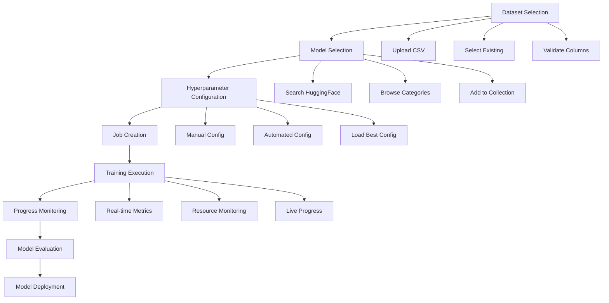
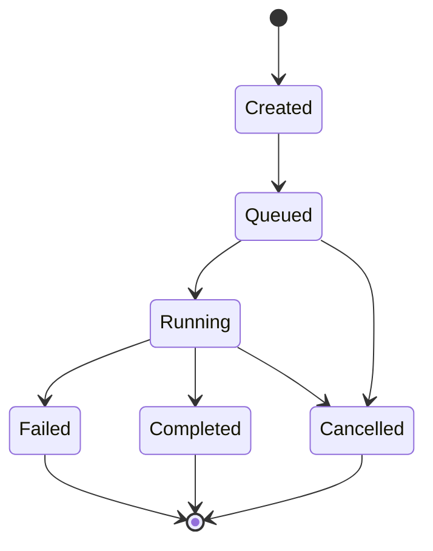

# AI Fine-tuning Dashboard - Complete Workflow Guide

This comprehensive guide walks through the entire fine-tuning workflow from dataset preparation to model deployment, covering both user interface and API interactions.

## 📋 Table of Contents

- [Overview](#overview)
- [Prerequisites](#prerequisites)
- [Step-by-Step Workflow](#step-by-step-workflow)
- [Advanced Features](#advanced-features)
- [API Integration](#api-integration)
- [Monitoring & Management](#monitoring--management)
- [Best Practices](#best-practices)
- [Troubleshooting](#troubleshooting)

---

## 🌐 Overview

The AI Fine-tuning Dashboard provides a complete platform for fine-tuning large language models with an intuitive web interface and powerful backend APIs.

### Workflow Stages



### Core Components

| Component | Purpose | Location |
|-----------|---------|----------|
| **Frontend Dashboard** | User interface and visualization | http://localhost:3000 |
| **Main API** | Core functionality, CRUD operations | http://127.0.0.1:8000 |
| **Training API** | Real-time training monitoring | http://127.0.0.1:8001 |
| **Data Storage** | Datasets, models, configurations | File system / Database |

---

## 🔧 Prerequisites

### System Requirements

#### Development Environment
- **Node.js**: 18+ for frontend
- **Python**: 3.11+ for backend
- **Memory**: 8GB+ RAM
- **Storage**: 20GB+ available space
- **Network**: Internet access for model downloads

#### Production Environment
- **CPU**: 8+ cores
- **Memory**: 32GB+ RAM
- **GPU**: NVIDIA RTX 4090 / A100 (for actual training)
- **Storage**: 500GB+ NVMe SSD
- **Network**: 10Gbps for large model transfers

### Software Dependencies

#### Frontend Dependencies
```bash
npm install next react typescript tailwindcss
npm install @radix-ui/react-components lucide-react
npm install recharts date-fns clsx
```

#### Backend Dependencies
```bash
uv add fastapi uvicorn pandas numpy
uv add huggingface-hub transformers torch
uv add sqlalchemy asyncpg redis
```

### Account Setup
- **HuggingFace Account**: For model search and downloads
- **GPU Provider**: NVIDIA drivers for local training
- **Cloud Storage**: S3/GCS for production file storage

---

## 🎯 Step-by-Step Workflow

### Stage 1: Dataset Selection

#### 1.1 Dataset Upload

**Via Web Interface:**
1. Navigate to Dataset Selection page
2. Click "Upload New Dataset"
3. Select CSV file with `input` and `output` columns
4. Review preview and validation results
5. Save dataset with descriptive name and tags

**Via API:**
```bash
curl -X POST http://127.0.0.1:8000/api/preview-csv \
  -F "file=@dataset.csv" \
  -H "Content-Type: multipart/form-data"
```

**Response:**
```json
{
  "filename": "dataset.csv",
  "columns": ["input", "output"],
  "data": [
    {
      "input": "What is machine learning?",
      "output": "Machine learning is a subset of AI that enables computers to learn from data."
    }
  ],
  "validation_errors": [],
  "statistics": {
    "total_rows": 1500,
    "total_columns": 2,
    "has_required_columns": true
  }
}
```

#### 1.2 Dataset Requirements

**Required Columns:**
- `input`: Text input for training
- `output`: Expected model response

**Best Practices:**
- **Minimum Rows**: 100+ examples
- **Quality**: Diverse, high-quality examples
- **Balance**: Varied input lengths and complexity
- **Consistency**: Consistent formatting and style

**Example Dataset Structure:**
```csv
input,output
"Explain quantum computing","Quantum computing uses quantum mechanical phenomena to process information."
"What is the capital of France?","The capital of France is Paris."
"How do neural networks work?","Neural networks are computing systems inspired by biological neural networks."
```

#### 1.3 Dataset Validation

The system validates:
- ✅ Required columns present
- ✅ No empty rows
- ✅ Reasonable data quality
- ✅ File size limits
- ✅ Encoding compatibility

**Validation Errors:**
```json
{
  "validation_errors": [
    "Missing required 'output' column",
    "Found 5 empty rows",
    "File exceeds 50MB limit"
  ]
}
```

---

### Stage 2: Model Selection

#### 2.1 Browse Available Models

**Via Web Interface:**
1. Navigate to Model Selection page
2. Browse by category or provider
3. Use search filters
4. View model details and capabilities

**Categories Available:**
- Text Generation
- Code Generation  
- Instruction Following
- Conversational
- Multimodal
- Compact Models

#### 2.2 Search HuggingFace Hub

**Search Interface:**
1. Enter search query (e.g., "gpt", "llama", "code")
2. Review search results with metrics
3. View model details and download size
4. Add selected models to collection

**API Search:**
```bash
curl "http://127.0.0.1:8000/api/models/search?query=llama&limit=5"
```

**Response:**
```json
[
  {
    "id": "meta-llama/Llama-3.1-8B-Instruct",
    "name": "Llama 3.1 8B Instruct",
    "provider": "Meta",
    "category": "Instruction Following",
    "parameters": "8B",
    "downloads": 50000,
    "likes": 1200,
    "description": "High-performance instruction-following model"
  }
]
```

#### 2.3 Model Management

**Add Model to Collection:**
```bash
curl -X POST http://127.0.0.1:8000/api/models \
  -H "Content-Type: application/json" \
  -d '{
    "id": "meta-llama/Llama-3.1-8B-Instruct",
    "name": "Llama 3.1 8B Instruct",
    "provider": "Meta",
    "category": "Instruction Following"
  }'
```

**Check Model Availability:**
```bash
curl "http://127.0.0.1:8000/api/models/check/meta-llama%2FLlama-3.1-8B-Instruct"
```

#### 2.4 Model Selection Criteria

**Performance Factors:**
- **Model Size**: Larger models = better quality, more resources
- **Specialization**: Task-specific models for better results
- **License**: Commercial vs. research use limitations
- **Hardware Requirements**: GPU memory and compute needs

**Recommendations by Use Case:**
- **Code Generation**: CodeLlama, StarCoder
- **Instruction Following**: Llama 3.1, FLAN-T5
- **Resource Constrained**: StableLM 3B, DistilBERT
- **Multilingual**: mBERT, XLM-R

---

### Stage 3: Hyperparameter Configuration

#### 3.1 Configuration Modes

**Manual Mode:**
- Full control over all parameters
- Expert-level customization
- Direct value input

**Automated Mode:**
- Range-based configuration
- Automatic parameter selection
- Beginner-friendly approach

#### 3.2 Key Hyperparameters

**Learning Parameters:**
```json
{
  "learning_rate": 0.0002,
  "batch_size": 8,
  "epochs": 3,
  "warmup_steps": 500,
  "weight_decay": 0.01
}
```

**LoRA Parameters:**
```json
{
  "lora_r": 16,
  "lora_alpha": 32,
  "lora_dropout": 0.1,
  "target_modules": ["q_proj", "v_proj"]
}
```

**Advanced Parameters:**
```json
{
  "gradient_accumulation_steps": 4,
  "max_grad_norm": 1.0,
  "optimizer": "adamw",
  "scheduler": "cosine",
  "save_steps": 500
}
```

#### 3.3 Configuration Best Practices

**Learning Rate Guidelines:**
- **Large Models (7B+)**: 1e-5 to 5e-5
- **Medium Models (1-7B)**: 5e-5 to 2e-4
- **Small Models (<1B)**: 1e-4 to 5e-4

**Batch Size Considerations:**
- **GPU Memory**: Larger batches need more VRAM
- **Training Stability**: Larger batches = more stable training
- **Convergence Speed**: Balance between speed and stability

**Epoch Recommendations:**
- **Large Datasets (>10k)**: 1-3 epochs
- **Medium Datasets (1k-10k)**: 3-5 epochs
- **Small Datasets (<1k)**: 5-10 epochs

#### 3.4 Configuration Management

**Save Configuration:**
The system automatically generates a UID for each configuration:
```
UID Format: [epochs][learning_rate][batch_size][lora_r][lora_alpha][mode]
Example: 00000005k0008000300100002s
```

**Load Best Configuration:**
```bash
curl "http://127.0.0.1:8000/api/configurations/best?mode=manual"
```

---

### Stage 4: Job Creation & Execution

#### 4.1 Create Fine-tuning Job

**Via Web Interface:**
1. Review configuration summary
2. Set job name and description
3. Add relevant tags
4. Configure model saving options
5. Submit job for execution

**Via API:**
```bash
curl -X POST http://127.0.0.1:8000/api/jobs \
  -H "Content-Type: application/json" \
  -d '{
    "name": "Customer Support Fine-tuning",
    "description": "Fine-tune Llama for customer support responses",
    "tags": ["customer-support", "llama", "production"],
    "configuration": {
      "model": {
        "uid": "meta-llama/Llama-3.1-8B-Instruct",
        "name": "Llama 3.1 8B Instruct"
      },
      "dataset": {
        "uid": "dataset_1751023766790_b0zqofldb",
        "name": "Customer Support Q&A"
      },
      "hyperparameters": {
        "uid": "00000005k0008000300100002s",
        "learning_rate": 0.0002,
        "batch_size": 8,
        "epochs": 3
      }
    },
    "modelSaving": {
      "saveModel": true,
      "modelName": "customer-support-llama-v1",
      "pushToHub": false,
      "makePublic": false
    }
  }'
```

#### 4.2 Job Configuration Options

**Model Saving:**
- **Save Model**: Whether to save the fine-tuned model
- **Model Name**: Custom name for the saved model
- **Push to Hub**: Upload to HuggingFace Hub
- **Make Public**: Public vs. private model

**Execution Settings:**
- **Priority**: High, medium, low priority queue
- **Resource Allocation**: GPU/CPU requirements
- **Timeout**: Maximum training duration
- **Checkpointing**: Save frequency for recovery

#### 4.3 Job Lifecycle

**Job States:**
1. **Created**: Job submitted, waiting for resources
2. **Queued**: In training queue, waiting for GPU
3. **Running**: Active training in progress
4. **Completed**: Training finished successfully
5. **Failed**: Training encountered errors
6. **Cancelled**: Manually cancelled by user

**State Transitions:**


---

### Stage 5: Training Monitoring

#### 5.1 Real-time Metrics Dashboard

**Live Training Metrics:**
- Training loss progression
- Validation loss tracking
- Learning rate scheduling
- Gradient norms and stability

**System Resource Monitoring:**
- GPU utilization and memory
- CPU usage and temperature
- RAM consumption
- Disk I/O and network

**Progress Indicators:**
- Current epoch and step
- Training time elapsed
- Estimated time remaining
- Overall completion percentage

#### 5.2 Training Data Streams

**WebSocket Connection:**
```javascript
const ws = new WebSocket('ws://127.0.0.1:8001/ws/training/job_123');

ws.onmessage = function(event) {
  const data = JSON.parse(event.data);
  
  // Update training metrics
  updateLossChart(data.training.train_loss, data.training.validation_loss);
  updateProgressBar(data.iteration, data.total);
  updateResourceMetrics(data.resources);
};
```

**REST API Polling:**
```bash
# Get current training status
curl "http://127.0.0.1:8001/api/training/summary"

# Get training losses
curl "http://127.0.0.1:8001/api/training/losses?last_n=50"

# Get resource metrics
curl "http://127.0.0.1:8001/api/training/resources/current"
```

#### 5.3 Training Analysis

**Loss Monitoring:**
- Track convergence patterns
- Identify overfitting signs
- Monitor validation performance
- Detect training instabilities

**Performance Metrics:**
- Samples per second
- FLOPS utilization
- Memory efficiency
- Power consumption

**Quality Indicators:**
- Gradient flow health
- Activation distributions
- Weight update magnitudes
- Learning rate effectiveness

#### 5.4 Intervention Points

**Manual Controls:**
- Pause/resume training
- Adjust learning rate dynamically
- Save intermediate checkpoints
- Early stopping triggers

**Automatic Interventions:**
- Learning rate scheduling
- Gradient clipping
- Memory optimization
- Error recovery

---

### Stage 6: Model Evaluation & Deployment

#### 6.1 Training Completion

**Automatic Evaluation:**
When training completes, the system provides:
- Final loss metrics
- Training summary statistics
- Model performance benchmarks
- Resource utilization report

**Model Artifacts:**
- Fine-tuned model weights
- Training configuration
- Evaluation metrics
- Training logs and charts

#### 6.2 Model Testing

**Quick Inference Test:**
```python
from transformers import AutoTokenizer, AutoModelForCausalLM

# Load fine-tuned model
tokenizer = AutoTokenizer.from_pretrained("./customer-support-llama-v1")
model = AutoModelForCausalLM.from_pretrained("./customer-support-llama-v1")

# Test inference
input_text = "How do I reset my password?"
inputs = tokenizer(input_text, return_tensors="pt")
outputs = model.generate(**inputs, max_length=100)
response = tokenizer.decode(outputs[0], skip_special_tokens=True)
print(response)
```

**Evaluation Metrics:**
- BLEU scores for text quality
- Perplexity measurements
- Human evaluation ratings
- Task-specific benchmarks

#### 6.3 Model Deployment Options

**Local Deployment:**
```python
# Simple FastAPI server
from fastapi import FastAPI
from transformers import pipeline

app = FastAPI()
generator = pipeline("text-generation", model="./customer-support-llama-v1")

@app.post("/generate")
async def generate_text(prompt: str):
    result = generator(prompt, max_length=200)
    return {"response": result[0]["generated_text"]}
```

**Cloud Deployment:**
- HuggingFace Hub hosting
- AWS SageMaker endpoints
- Google Cloud AI Platform
- Azure Machine Learning

**Production Considerations:**
- Model quantization for efficiency
- Batched inference optimization
- Caching and CDN integration
- A/B testing frameworks

---

## 🚀 Advanced Features

### Experiment Tracking

#### Configuration Comparison
```bash
# Compare different configurations
curl "http://127.0.0.1:8000/api/jobs/compare" \
  -H "Content-Type: application/json" \
  -d '{
    "job_ids": ["job_123", "job_456", "job_789"],
    "metrics": ["final_loss", "training_time", "gpu_hours"]
  }'
```

#### A/B Testing Framework
```python
class ExperimentManager:
    def __init__(self):
        self.experiments = {}
    
    def create_experiment(self, name: str, variants: List[Dict]):
        """Create A/B test with multiple model variants"""
        self.experiments[name] = {
            "variants": variants,
            "metrics": {},
            "traffic_split": 1.0 / len(variants)
        }
    
    def evaluate_variant(self, experiment: str, variant_id: str, test_data: List):
        """Evaluate specific variant performance"""
        # Run evaluation and collect metrics
        pass
```

### Automated Hyperparameter Tuning

#### Bayesian Optimization
```python
from skopt import gp_minimize
from skopt.space import Real, Integer

def objective(params):
    learning_rate, batch_size, lora_r = params
    
    # Run training with these parameters
    job_result = train_model(
        learning_rate=learning_rate,
        batch_size=batch_size,
        lora_r=lora_r
    )
    
    # Return metric to minimize (e.g., validation loss)
    return job_result["final_validation_loss"]

# Define search space
space = [
    Real(1e-6, 1e-3, name='learning_rate'),
    Integer(4, 32, name='batch_size'),
    Integer(8, 64, name='lora_r')
]

# Run optimization
result = gp_minimize(objective, space, n_calls=20)
```

#### Grid Search
```python
import itertools

def grid_search(param_grid: Dict[str, List]):
    """Exhaustive search over parameter combinations"""
    keys = param_grid.keys()
    values = param_grid.values()
    
    results = []
    for combination in itertools.product(*values):
        params = dict(zip(keys, combination))
        
        # Train model with this configuration
        result = train_model(**params)
        results.append({
            "params": params,
            "loss": result["final_loss"],
            "time": result["training_time"]
        })
    
    # Sort by performance
    results.sort(key=lambda x: x["loss"])
    return results
```

### Multi-Model Ensemble

#### Ensemble Training
```python
class EnsembleTrainer:
    def __init__(self, base_models: List[str]):
        self.base_models = base_models
        self.trained_models = []
    
    def train_ensemble(self, dataset, num_models=3):
        """Train multiple models with different seeds"""
        for i in range(num_models):
            for base_model in self.base_models:
                config = {
                    "model": base_model,
                    "seed": i * 42,
                    "learning_rate": np.random.uniform(1e-5, 1e-4)
                }
                
                model = self.train_single_model(dataset, config)
                self.trained_models.append(model)
    
    def predict_ensemble(self, inputs: List[str]):
        """Get predictions from all models and ensemble"""
        predictions = []
        for model in self.trained_models:
            pred = model.predict(inputs)
            predictions.append(pred)
        
        # Ensemble strategy (e.g., voting, averaging)
        return self.ensemble_predictions(predictions)
```

---

## 🔗 API Integration

### Complete API Workflow

#### 1. Dataset Management API
```python
import requests
import json

class FinetuningClient:
    def __init__(self, base_url="http://127.0.0.1:8000"):
        self.base_url = base_url
    
    def upload_dataset(self, file_path: str, name: str, description: str):
        """Upload and validate dataset"""
        with open(file_path, 'rb') as f:
            files = {'file': f}
            response = requests.post(f"{self.base_url}/api/preview-csv", files=files)
        
        if response.status_code == 200:
            preview = response.json()
            if preview["statistics"]["has_required_columns"]:
                # Save dataset
                dataset_data = {
                    "name": name,
                    "description": description,
                    "preview": preview
                }
                return self.save_dataset(dataset_data)
        
        return response.json()
    
    def search_models(self, query: str, limit: int = 10):
        """Search HuggingFace models"""
        response = requests.get(
            f"{self.base_url}/api/models/search",
            params={"query": query, "limit": limit}
        )
        return response.json()
    
    def create_job(self, job_config: dict):
        """Create fine-tuning job"""
        response = requests.post(
            f"{self.base_url}/api/jobs",
            json=job_config
        )
        return response.json()
```

#### 2. Training Monitoring API
```python
class TrainingMonitor:
    def __init__(self, training_url="http://127.0.0.1:8001"):
        self.training_url = training_url
    
    def get_job_status(self, job_id: str):
        """Get current training status"""
        response = requests.get(f"{self.training_url}/api/training/status/{job_id}")
        return response.json()
    
    def get_training_metrics(self, last_n: int = 50):
        """Get recent training metrics"""
        response = requests.get(
            f"{self.training_url}/api/training/losses",
            params={"last_n": last_n}
        )
        return response.json()
    
    def stream_training_data(self, job_id: str, callback):
        """Stream real-time training data"""
        import websocket
        
        def on_message(ws, message):
            data = json.loads(message)
            callback(data)
        
        ws = websocket.WebSocketApp(
            f"ws://127.0.0.1:8001/ws/training/{job_id}",
            on_message=on_message
        )
        ws.run_forever()
```

### SDK Example Usage

```python
# Initialize clients
client = FinetuningClient()
monitor = TrainingMonitor()

# 1. Upload dataset
dataset_result = client.upload_dataset(
    file_path="./customer_support.csv",
    name="Customer Support Dataset",
    description="Q&A pairs for customer support fine-tuning"
)

# 2. Search and select model
models = client.search_models("llama", limit=5)
selected_model = models[0]

# 3. Create training job
job_config = {
    "name": "Customer Support Fine-tuning",
    "description": "Fine-tune Llama for customer support",
    "configuration": {
        "model": selected_model,
        "dataset": {"uid": dataset_result["uid"]},
        "hyperparameters": {
            "learning_rate": 0.0002,
            "batch_size": 8,
            "epochs": 3
        }
    }
}

job_result = client.create_job(job_config)
job_id = job_result["jobUid"]

# 4. Monitor training
def training_callback(data):
    print(f"Epoch: {data['training']['epoch']}, Loss: {data['training']['train_loss']:.4f}")

monitor.stream_training_data(job_id, training_callback)
```

---

## 📊 Monitoring & Management

### Dashboard Analytics

#### Performance Metrics
- **Throughput**: Jobs per hour/day
- **Success Rate**: Percentage of successful completions
- **Resource Utilization**: GPU/CPU usage efficiency
- **Queue Management**: Wait times and bottlenecks

#### User Analytics
- **Popular Models**: Most frequently used models
- **Dataset Patterns**: Common dataset characteristics
- **Configuration Trends**: Popular hyperparameter choices
- **User Behavior**: Workflow completion rates

### Operational Monitoring

#### Health Checks
```bash
# Automated health monitoring
#!/bin/bash

# Check all services
services=("frontend:3000" "main-api:8000" "training-api:8001")

for service in "${services[@]}"; do
    name=$(echo $service | cut -d: -f1)
    port=$(echo $service | cut -d: -f2)
    
    if curl -f http://localhost:$port/health > /dev/null 2>&1; then
        echo "✅ $name is healthy"
    else
        echo "❌ $name is down"
        # Alert/restart logic here
    fi
done

# Check database connectivity
if psql $DATABASE_URL -c "SELECT 1" > /dev/null 2>&1; then
    echo "✅ Database is accessible"
else
    echo "❌ Database connection failed"
fi
```

#### Resource Monitoring
```python
import psutil
import GPUtil

def get_system_metrics():
    """Collect comprehensive system metrics"""
    # CPU metrics
    cpu_percent = psutil.cpu_percent(interval=1)
    cpu_temp = psutil.sensors_temperatures().get('coretemp', [{}])[0].get('current', 0)
    
    # Memory metrics
    memory = psutil.virtual_memory()
    
    # Disk metrics
    disk = psutil.disk_usage('/')
    
    # GPU metrics
    gpus = GPUtil.getGPUs()
    gpu_metrics = []
    for gpu in gpus:
        gpu_metrics.append({
            "id": gpu.id,
            "name": gpu.name,
            "load": gpu.load * 100,
            "memory_used": gpu.memoryUsed,
            "memory_total": gpu.memoryTotal,
            "temperature": gpu.temperature
        })
    
    return {
        "cpu": {
            "percent": cpu_percent,
            "temperature": cpu_temp,
            "cores": psutil.cpu_count()
        },
        "memory": {
            "percent": memory.percent,
            "used_gb": memory.used / (1024**3),
            "total_gb": memory.total / (1024**3)
        },
        "disk": {
            "percent": (disk.used / disk.total) * 100,
            "used_gb": disk.used / (1024**3),
            "total_gb": disk.total / (1024**3)
        },
        "gpus": gpu_metrics
    }
```

### Alert System

#### Threshold-based Alerts
```python
class AlertManager:
    def __init__(self):
        self.thresholds = {
            "cpu_percent": 90,
            "memory_percent": 85,
            "gpu_temp": 85,
            "error_rate": 5,  # percentage
            "response_time": 2000  # milliseconds
        }
    
    def check_system_health(self):
        """Check system metrics against thresholds"""
        metrics = get_system_metrics()
        alerts = []
        
        if metrics["cpu"]["percent"] > self.thresholds["cpu_percent"]:
            alerts.append({
                "level": "warning",
                "message": f"High CPU usage: {metrics['cpu']['percent']:.1f}%"
            })
        
        if metrics["memory"]["percent"] > self.thresholds["memory_percent"]:
            alerts.append({
                "level": "critical",
                "message": f"High memory usage: {metrics['memory']['percent']:.1f}%"
            })
        
        for gpu in metrics["gpus"]:
            if gpu["temperature"] > self.thresholds["gpu_temp"]:
                alerts.append({
                    "level": "critical",
                    "message": f"GPU {gpu['id']} overheating: {gpu['temperature']}°C"
                })
        
        return alerts
    
    def send_alerts(self, alerts):
        """Send alerts via configured channels"""
        for alert in alerts:
            if alert["level"] == "critical":
                self.send_slack_alert(alert)
                self.send_email_alert(alert)
            else:
                self.send_slack_alert(alert)
```

---

## 💡 Best Practices

### Dataset Preparation

#### Quality Guidelines
1. **Diverse Examples**: Include varied input types and lengths
2. **Balanced Distribution**: Avoid skewed data distributions
3. **Clean Data**: Remove duplicates and low-quality samples
4. **Consistent Format**: Maintain uniform formatting conventions
5. **Adequate Size**: Minimum 100-500 examples per task

#### Data Preprocessing
```python
def prepare_dataset(df):
    """Comprehensive dataset preparation"""
    # Remove duplicates
    df = df.drop_duplicates(subset=['input', 'output'])
    
    # Filter by length
    df = df[df['input'].str.len() >= 10]
    df = df[df['input'].str.len() <= 2048]
    df = df[df['output'].str.len() >= 5]
    df = df[df['output'].str.len() <= 1024]
    
    # Clean text
    df['input'] = df['input'].str.strip()
    df['output'] = df['output'].str.strip()
    
    # Validate format
    assert all(df['input'].notna()), "Found empty input rows"
    assert all(df['output'].notna()), "Found empty output rows"
    
    return df
```

### Model Selection

#### Selection Criteria
1. **Task Alignment**: Choose models specialized for your use case
2. **Resource Constraints**: Consider GPU memory and compute requirements
3. **License Compatibility**: Ensure license allows your intended use
4. **Community Support**: Active maintenance and documentation
5. **Performance Benchmarks**: Published evaluation results

#### Model Categories

**For Code Generation:**
- CodeLlama (7B-34B): Meta's specialized code model
- StarCoder (15B): Open-source code generation
- CodeT5+ (2B-16B): Encoder-decoder architecture

**For Instruction Following:**
- Llama 3.1 (8B-70B): Strong general-purpose performance
- FLAN-T5 (3B-11B): Instruction-tuned T5 models
- Mistral (7B): Efficient and high-quality

**For Compact Deployment:**
- StableLM 3B: Efficient baseline model
- DistilBERT: Lightweight encoder model
- TinyLlama (1.1B): Ultra-compact language model

### Training Configuration

#### Learning Rate Scheduling
```python
def get_learning_rate_schedule(total_steps, warmup_ratio=0.1):
    """Cosine learning rate schedule with warmup"""
    warmup_steps = int(total_steps * warmup_ratio)
    
    def lr_lambda(current_step):
        if current_step < warmup_steps:
            return float(current_step) / float(max(1, warmup_steps))
        
        progress = float(current_step - warmup_steps) / float(max(1, total_steps - warmup_steps))
        return max(0.0, 0.5 * (1.0 + math.cos(math.pi * progress)))
    
    return lr_lambda
```

#### Memory Optimization
```python
def optimize_memory_usage(model_size_gb, available_memory_gb):
    """Calculate optimal batch size and gradient accumulation"""
    # Rule of thumb: model uses ~4x its size in memory during training
    model_memory = model_size_gb * 4
    available_for_batch = available_memory_gb - model_memory
    
    # Each sample uses approximately 2MB per 1000 tokens
    sample_memory_mb = 2
    max_batch_size = int((available_for_batch * 1024) / sample_memory_mb)
    
    # Find optimal batch size (power of 2)
    batch_size = 1
    while batch_size * 2 <= max_batch_size:
        batch_size *= 2
    
    # Calculate gradient accumulation for effective batch size of 32
    target_effective_batch = 32
    gradient_accumulation = max(1, target_effective_batch // batch_size)
    
    return {
        "batch_size": batch_size,
        "gradient_accumulation_steps": gradient_accumulation,
        "effective_batch_size": batch_size * gradient_accumulation
    }
```

### Production Deployment

#### Model Optimization
```python
def optimize_for_inference(model_path):
    """Optimize model for production inference"""
    from transformers import AutoModelForCausalLM, AutoTokenizer
    import torch
    
    # Load model
    model = AutoModelForCausalLM.from_pretrained(model_path)
    tokenizer = AutoTokenizer.from_pretrained(model_path)
    
    # Quantization for efficiency
    model = torch.quantization.quantize_dynamic(
        model, {torch.nn.Linear}, dtype=torch.qint8
    )
    
    # Compile for faster inference
    if torch.version.cuda:
        model = torch.compile(model)
    
    # Save optimized model
    optimized_path = f"{model_path}_optimized"
    model.save_pretrained(optimized_path)
    tokenizer.save_pretrained(optimized_path)
    
    return optimized_path
```

#### Serving Configuration
```python
from fastapi import FastAPI
from transformers import pipeline
import asyncio
from functools import lru_cache

app = FastAPI()

@lru_cache(maxsize=1)
def load_model():
    """Cache model loading"""
    return pipeline(
        "text-generation",
        model="./optimized_model",
        device=0 if torch.cuda.is_available() else -1,
        batch_size=8
    )

class InferenceManager:
    def __init__(self):
        self.model = load_model()
        self.queue = asyncio.Queue(maxsize=100)
        self.batch_size = 8
        
    async def batch_inference(self):
        """Process requests in batches for efficiency"""
        while True:
            batch = []
            for _ in range(self.batch_size):
                try:
                    request = await asyncio.wait_for(self.queue.get(), timeout=0.1)
                    batch.append(request)
                except asyncio.TimeoutError:
                    break
            
            if batch:
                prompts = [req["prompt"] for req in batch]
                results = self.model(prompts, max_length=200, batch_size=len(prompts))
                
                for req, result in zip(batch, results):
                    req["future"].set_result(result[0]["generated_text"])

@app.post("/generate")
async def generate_text(prompt: str):
    future = asyncio.Future()
    await inference_manager.queue.put({"prompt": prompt, "future": future})
    result = await future
    return {"response": result}
```

---

## 🔧 Troubleshooting

### Common Issues

#### Training Convergence Problems

**Issue**: Training loss not decreasing
```python
def diagnose_convergence_issues(training_logs):
    """Analyze training logs for convergence problems"""
    losses = [log["train_loss"] for log in training_logs]
    
    # Check for decreasing trend
    if len(losses) > 10:
        recent_trend = losses[-10:]
        if all(l1 >= l2 for l1, l2 in zip(recent_trend[:-1], recent_trend[1:])):
            return "Learning rate may be too low"
    
    # Check for oscillations
    oscillations = sum(1 for i in range(1, len(losses)-1) 
                      if (losses[i] > losses[i-1]) != (losses[i+1] > losses[i]))
    if oscillations > len(losses) * 0.5:
        return "Learning rate may be too high - try reducing by 10x"
    
    # Check for NaN or infinite values
    if any(math.isnan(loss) or math.isinf(loss) for loss in losses):
        return "Numerical instability - reduce learning rate and check data"
    
    return "Training appears normal"
```

**Solutions**:
- Reduce learning rate by 2-10x
- Increase warmup steps
- Check data quality and preprocessing
- Verify gradient clipping is enabled

#### Memory Issues

**Issue**: Out of memory (OOM) errors
```python
def handle_oom_error(model_size, current_batch_size):
    """Provide OOM recovery suggestions"""
    suggestions = []
    
    # Reduce batch size
    new_batch_size = max(1, current_batch_size // 2)
    suggestions.append(f"Reduce batch size from {current_batch_size} to {new_batch_size}")
    
    # Increase gradient accumulation
    target_effective_batch = 32
    gradient_accum = max(1, target_effective_batch // new_batch_size)
    suggestions.append(f"Use gradient accumulation: {gradient_accum} steps")
    
    # Model optimization suggestions
    if model_size > 7000:  # 7B+ parameters
        suggestions.append("Consider using LoRA with lower rank (r=8 or r=4)")
        suggestions.append("Enable gradient checkpointing")
        suggestions.append("Use fp16 or bf16 mixed precision")
    
    return suggestions
```

**Solutions**:
- Reduce batch size
- Use gradient accumulation
- Enable gradient checkpointing
- Use mixed precision training
- Consider model parallelism for large models

#### Data Loading Issues

**Issue**: Slow data loading or preprocessing
```python
def optimize_data_loading(dataset_size, current_speed):
    """Optimize data loading performance"""
    optimizations = []
    
    if dataset_size > 10000:
        optimizations.append("Use multiprocessing for data loading")
        optimizations.append("Pre-tokenize dataset and cache")
        optimizations.append("Use memory mapping for large datasets")
    
    if current_speed < 100:  # samples per second
        optimizations.append("Increase number of data loader workers")
        optimizations.append("Use SSD storage for dataset")
        optimizations.append("Pin memory in data loader")
    
    return optimizations
```

### Debugging Tools

#### Training Diagnostics
```python
class TrainingDiagnostics:
    def __init__(self):
        self.metrics_history = []
    
    def log_metrics(self, step, metrics):
        """Log training metrics for analysis"""
        self.metrics_history.append({
            "step": step,
            "timestamp": time.time(),
            **metrics
        })
    
    def analyze_training_health(self):
        """Comprehensive training health analysis"""
        if len(self.metrics_history) < 10:
            return "Insufficient data for analysis"
        
        recent_metrics = self.metrics_history[-10:]
        
        # Gradient analysis
        grad_norms = [m.get("grad_norm", 0) for m in recent_metrics]
        avg_grad_norm = sum(grad_norms) / len(grad_norms)
        
        if avg_grad_norm > 10:
            return "High gradient norms - consider gradient clipping"
        elif avg_grad_norm < 0.001:
            return "Very low gradients - learning rate may be too small"
        
        # Loss analysis
        losses = [m.get("train_loss", float('inf')) for m in recent_metrics]
        loss_trend = self.calculate_trend(losses)
        
        if loss_trend > 0:
            return "Loss is increasing - check for overfitting or high learning rate"
        elif abs(loss_trend) < 1e-6:
            return "Loss has plateaued - consider learning rate decay"
        
        return "Training appears healthy"
    
    def calculate_trend(self, values):
        """Calculate trend using linear regression"""
        n = len(values)
        x = list(range(n))
        slope = (n * sum(x[i] * values[i] for i in range(n)) - sum(x) * sum(values)) / \
                (n * sum(x[i]**2 for i in range(n)) - sum(x)**2)
        return slope
```

#### Performance Profiling
```python
import cProfile
import pstats

def profile_training_step(training_function):
    """Profile training step performance"""
    profiler = cProfile.Profile()
    profiler.enable()
    
    # Run training step
    result = training_function()
    
    profiler.disable()
    
    # Analyze results
    stats = pstats.Stats(profiler)
    stats.sort_stats('cumulative')
    
    # Get top time-consuming functions
    bottlenecks = []
    for stat in stats.get_stats_profile().func_profiles.items():
        func_name, profile = stat
        if profile.cumtime > 0.1:  # Functions taking >100ms
            bottlenecks.append({
                "function": func_name,
                "time": profile.cumtime,
                "calls": profile.callcount
            })
    
    return {
        "result": result,
        "bottlenecks": sorted(bottlenecks, key=lambda x: x["time"], reverse=True)
    }
```

### Recovery Procedures

#### Checkpoint Recovery
```python
def recover_from_checkpoint(checkpoint_path, job_config):
    """Recover training from the latest checkpoint"""
    import torch
    from transformers import AutoModelForCausalLM, AutoTokenizer
    
    # Load checkpoint
    checkpoint = torch.load(checkpoint_path)
    
    # Restore model state
    model = AutoModelForCausalLM.from_pretrained(job_config["model_path"])
    model.load_state_dict(checkpoint["model_state_dict"])
    
    # Restore optimizer state
    optimizer = torch.optim.AdamW(model.parameters())
    optimizer.load_state_dict(checkpoint["optimizer_state_dict"])
    
    # Restore training state
    start_epoch = checkpoint["epoch"]
    start_step = checkpoint["step"]
    best_loss = checkpoint.get("best_loss", float('inf'))
    
    return {
        "model": model,
        "optimizer": optimizer,
        "start_epoch": start_epoch,
        "start_step": start_step,
        "best_loss": best_loss
    }
```

#### Data Corruption Recovery
```python
def validate_and_repair_dataset(dataset_path):
    """Validate dataset and attempt automatic repair"""
    import pandas as pd
    
    try:
        # Try to load dataset
        df = pd.read_csv(dataset_path)
    except Exception as e:
        return {"status": "error", "message": f"Cannot load dataset: {e}"}
    
    issues = []
    repairs = []
    
    # Check required columns
    if "input" not in df.columns:
        issues.append("Missing 'input' column")
    if "output" not in df.columns:
        issues.append("Missing 'output' column")
    
    if issues:
        return {"status": "error", "issues": issues}
    
    # Check for empty rows
    empty_inputs = df["input"].isna() | (df["input"] == "")
    empty_outputs = df["output"].isna() | (df["output"] == "")
    
    if empty_inputs.any() or empty_outputs.any():
        # Remove empty rows
        original_len = len(df)
        df = df.dropna(subset=["input", "output"])
        df = df[(df["input"] != "") & (df["output"] != "")]
        new_len = len(df)
        
        if new_len < original_len:
            repairs.append(f"Removed {original_len - new_len} empty rows")
    
    # Save repaired dataset
    if repairs:
        repair_path = dataset_path.replace(".csv", "_repaired.csv")
        df.to_csv(repair_path, index=False)
        repairs.append(f"Saved repaired dataset to {repair_path}")
    
    return {
        "status": "success",
        "issues": issues,
        "repairs": repairs,
        "final_rows": len(df)
    }
```

This comprehensive workflow guide provides everything needed to successfully use the AI Fine-tuning Dashboard, from basic usage to advanced production deployment. Follow the step-by-step instructions and adapt the configurations to your specific use case and requirements.